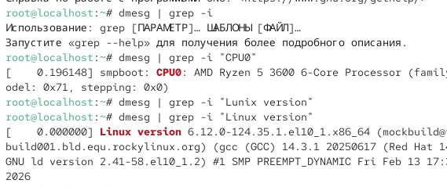

---
## Author
author:
  name: Осипов Никита Александрович
  degrees: Бакалавр
  orcid: 0000-0002-0877-7063
  email: 1132242906@rudn.ru
  affiliation:
    - name: Российский университет дружбы народов
      country: Российская Федерация
      postal-code: 117198
      city: Москва
      address: ул. Миклухо-Маклая, д. 21

## Title
title: "Лабораторная работа 1"
subtitle: "Установка и конфигурация операционной системы на виртуальную машину"
license: "CC BY"
---

# Цель работы

Целью данной работы является приобретение практических навыков
установки операционной системы на виртуальную машину, настройки минимально необходимых для дальнейшей работы сервисов.

# Задание

Настроить Virtual Box и поставить на него Rocky OS.

# Выполнение лабораторной работы

Создаем новую виртуальную машину, добавляем образ Rocky boot

Делаем первоначальные настройки

После настройки, запускаем виртуальную машину, выбираем загруузочный диск, задаем параметры установки.

Нажимаем "Готово" и ждем окончания загрузки. Затем входим в систему 

Выполняем дополнительные задания

# Выводы

Я приобрел практические навыки установки операционной системы на виртуальную машину, настройки минимально необходимых для дальнейшей работы сервисов.

