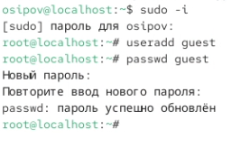
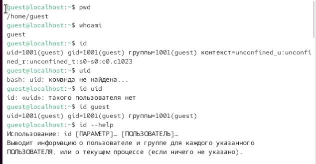
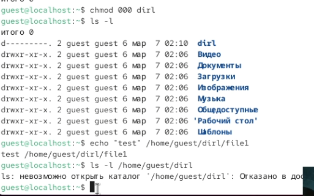

---
## Author
author:
  name: Осипов Никита Александрович
  degrees: DSc
  orcid: 0000-0002-0877-7063
  email: 1132242906@rudn.ru
  affiliation:
    - name: Российский университет дружбы народов
      country: Российская Федерация
      postal-code: 117198
      city: Москва
      address: ул. Миклухо-Маклая, д. 21

## Title
title: "Лабораторная работа №2"
subtitle: "Дискреционное разграничение прав в Linux. Основные атрибуты"
license: "CC BY"
---

# Цель работы

Получение практических навыков работы в консоли с атрибутами файлов, закрепление теоретических основ дискреционного разграничения доступа в современных системах с открытым кодом на базе ОС Linux.

# Задание

Постарайтесь последовательно выполнить все пункты, занося ваши ответы на поставленные вопросы и замечания в отчёт.
1. В установленной при выполнении предыдущей лабораторной работы
операционной системе создайте учётную запись пользователя guest (использую учётную запись администратора):
useradd guest
2. Задайте пароль для пользователя guest (использую учётную запись администратора):
passwd guest
3. Войдите в систему от имени пользователя guest.
4. Определите директорию, в которой вы находитесь, командой pwd. Сравните её с приглашением командной строки. Определите, является ли она
вашей домашней директорией? Если нет, зайдите в домашнюю директорию.
5. Уточните имя вашего пользователя командой whoami.
6. Уточните имя вашего пользователя, его группу, а также группы, куда входит пользователь, командой id. Выведенные значения uid, gid и др. запомните. Сравните вывод id с выводом команды groups.
7. Сравните полученную информацию об имени пользователя с данными,
выводимыми в приглашении командной строки.
8. Просмотрите файл /etc/passwd командой
cat /etc/passwd
Найдите в нём свою учётную запись. Определите uid пользователя.
Определите gid пользователя. Сравните найденные значения с полученными в предыдущих пунктах.
Замечание: в случае, когда вывод команды не умещается на одном
экране монитора, используйте прокрутку вверх–вниз (удерживая клавишу shift, нажимайте page up и page down) либо программу grep качестве фильтра для вывода только строк, содержащих определённые
буквенные сочетания:
cat /etc/passwd | grep guest
9. Определите существующие в системе директории командой
ls -l /home/
Удалось ли вам получить список поддиректорий директории /home? Какие права установлены на директориях?
10. Проверьте, какие расширенные атрибуты установлены на поддиректориях, находящихся в директории /home, командой:
lsattr /home
Удалось ли вам увидеть расширенные атрибуты директории?
Удалось ли вам увидеть расширенные атрибуты директорий других
пользователей?
11. Создайте в домашней директории поддиректорию dir1 командой
mkdir dir1
Определите командами ls -l и lsattr, какие права доступа и расширенные атрибуты были выставлены на директорию dir1.
12. Снимите с директории dir1 все атрибуты командой
chmod 000 dir1
и проверьте с её помощью правильность выполнения команды
ls -l
13. Попытайтесь создать в директории dir1 файл file1 командой
echo "test" > /home/guest/dir1/file1
Объясните, почему вы получили отказ в выполнении операции по созданию файла?
Оцените, как сообщение об ошибке отразилось на создании файла? Проверьте командой
ls -l /home/guest/dir1
действительно ли файл file1 не находится внутри директории dir1.
14. Заполните таблицу «Установленные права и разрешённые действия»
(см. табл. 2.1), выполняя действия от имени владельца директории (файлов), определив опытным путём, какие операции разрешены, а какие нет.
Если операция разрешена, занесите в таблицу знак «+», если не разрешена, знак «-».
Замечание 1: при заполнении табл. 2.1 рассматриваются не все атрибуты файлов и директорий, а лишь «первые три»: г, w, х, для «владельца».
Остальные атрибуты также важны (особенно при использовании доступа от имени разных пользователей, входящих в те или иные группы).
Проверка всех атрибутов при всех условиях значительно увеличила бы
таблицу: так 9 атрибутов на директорию и 9 атрибутов на файл дают
218 строк без учёта дополнительных атрибутов, плюс таблица была бы
расширена по количеству столбцов, так как все приведённые операции
необходимо было бы повторить ещё как минимум для двух пользователей: входящего в группу владельца файла и не входящего в неё.
После полного заполнения табл. 2.1 и анализа полученных данных нам
удалось бы выяснить, что заполнение её в таком виде излишне. Можно разделить большую таблицу на несколько малых независимых таблиц.
В данном примере предлагается рассмотреть 3 + 3 атрибута, т.е. 2
6 = 64
варианта

# Выполнение лабораторной работы

1. Создаем гостевую учетную запись и задаем ей пароль через командую строку.

2. Заходим в гостевую запись и проверяем базовые параметры

3. Создаем папку и проверяем доступ к ней

# Выводы

Я получил практические навыки работы в консоли с атрибутами файлов, закрепил теоретические основы дискреционного разграничения доступа в современных системах с открытым кодом на базе ОС Linux.

# Список литературы{.unnumbered}

::: {#refs}
:::
